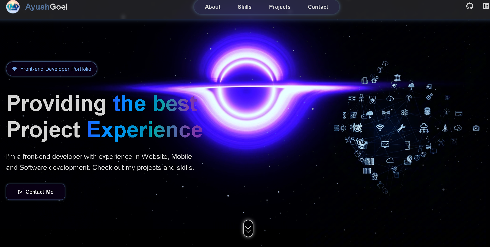

<<<<<<< HEAD
# 🌐 Animated Portfolio Website

A fully responsive and modern animated portfolio built with **React** and **Vite**, designed to showcase personal projects, skills, and experience in an elegant and engaging way.

## 🚀 Features

- 🎨 Smooth Animations & Transitions
- 📱 Fully Responsive (Desktop, Tablet & Mobile)
- 🖼️ Projects Showcase Section
- 📧 Contact Form with Validation
- 🢁 About Me Section with Skills
- 🌙 Dark Mode Support 
- ⚡ Built with React + Vite for fast performance

## 📸 Demo

Live Website: [https://animated-portfolio-two-murex.vercel.app/](https://animated-portfolio-two-murex.vercel.app/)

## 🛠️ Tech Stack

- **Frontend:** React, Vite, TailwindCSS / SCSS / CSS3
- **Animations:** Framer Motion / AOS (Animate on Scroll)
- **Deployment:** Vercel / Netlify / GitHub Pages

## 📂 Folder Structure

```
📁 src/
 ├📁 assets/           # Images & media
 ├📁 components/       # Reusable UI components
 ├📁 pages/            # Sections like About, Projects, Contact
 ├📁 styles/           # CSS or Tailwind config
 ├📄 App.jsx           # Main app file
 └📄 main.jsx          # Entry point
```

## ⚙️ Installation & Running Locally

```bash
# Clone the repo
git clone https://github.com/Ayush-Goel20/Animated-Portfolio.git

# Navigate into the folder
cd Animated-Portfolio

# Install dependencies
npm install

# Start the development server
npm run dev
```

## 📦 Deployment

Deployed using [Vercel](https://vercel.com) — push to your main branch and Vercel auto-deploys.

## 🖼️ Screenshots

### 💻 Desktop View



### 📱 Mobile View


## 🙌 Acknowledgements

Thanks to open-source tools and inspirations from modern developer portfolios.

## 📧 Contact

If you'd like to connect:

- 📧 [ayushgoel544@gmail.com](mailto\:ayushgoel544@gmail.com)
- 💼 [LinkedIn](https://www.linkedin.com/in/ayush-goel-5b54a018a)

---

⭐️ If you like this project, feel free to **star** it and follow for more updates!


=======
# portfolio
>>>>>>> fa0251a437d69a844af7dc4533ee94bc03fdc68c
